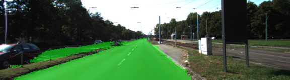
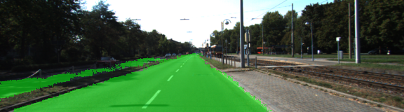
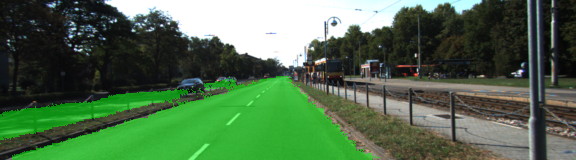
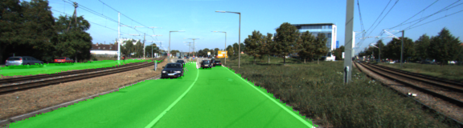
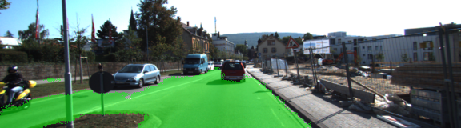
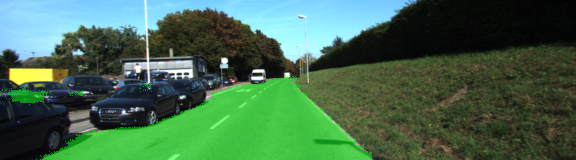
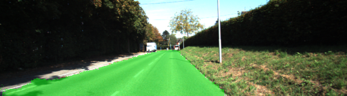
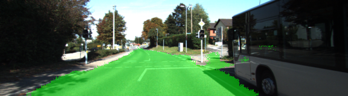

# Semantic Segmentation Project
Udacity Self-Driving Car Nanodegree Semantic Segmentation Project

### Project Overview and Implementation

The goal for this project was to use semantic segmentation to detect pixels that are part of the road in an image. to accomplish this a Fully Convolutional Network (FCN) was used based on VGG-16 classifier that identifies road area in an image and trained using the KITTI data set.

FCN help in maintaining spatial information that is usually lost in fully connected layers by replacing fully connected layers with 1x1 convolutions and using transposed convolutions to upsample previous layers. There are two main components in a FCN: the encoder and decoder. The encoder can be thought as a traditional CNN with fully connected layers replaced by the 1x1 convolutions so that we preserve spatial information. For the project, we are using a pretrained VGG-16 model traned on ImageNet. The decoder is made up of transpose convolutions that upsample the input to the original size. Skip connections are also used to retain information so that information can be combined from non-adjacent layers. The overal architecture the is:

* Encoder - pretained VGG-16 network
* 1x1 convolution for the fully connected layer
* Decoder - transpose convolutions with skip connections

The process for implementing the project consist first of loading the VGG model and getting the desired layers using TesorFlow get_tensor_by_name method, in this case we are interested in the input layer, layer 3, layer 4, and layer 7. The next step is to define the model for the decoder part where we will use 1x1 convolution for layer 7, transpose convolution for layer 3, layer 4, and layer 7,  and adding the skip connections for each layer using an addition operation. The next step is to specify the optimizer for training the network and adding the training routine for the set epoch and defined batch size for the input images. In order to train the network, an Adam optimizer is used and trained for 50 epochs and a batch size of 5. The resulting images from testing the model show the road area detected by our model successfully, here are some samples of the results:











The full test output can be found in the runs directory of the proeject.


## Project Information

### Introduction
In this project, you'll label the pixels of a road in images using a Fully Convolutional Network (FCN).

### Setup
##### Frameworks and Packages
Make sure you have the following is installed:
 - [Python 3](https://www.python.org/)
 - [TensorFlow](https://www.tensorflow.org/)
 - [NumPy](http://www.numpy.org/)
 - [SciPy](https://www.scipy.org/)
##### Dataset
Download the [Kitti Road dataset](http://www.cvlibs.net/datasets/kitti/eval_road.php) from [here](http://www.cvlibs.net/download.php?file=data_road.zip).  Extract the dataset in the `data` folder.  This will create the folder `data_road` with all the training a test images.

### Start
##### Implement
Implement the code in the `main.py` module indicated by the "TODO" comments.
The comments indicated with "OPTIONAL" tag are not required to complete.
##### Run
Run the following command to run the project:
```
python main.py
```
**Note** If running this in Jupyter Notebook system messages, such as those regarding test status, may appear in the terminal rather than the notebook.

### Submission
1. Ensure you've passed all the unit tests.
2. Ensure you pass all points on [the rubric](https://review.udacity.com/#!/rubrics/989/view).
3. Submit the following in a zip file.
 - `helper.py`
 - `main.py`
 - `project_tests.py`
 - Newest inference images from `runs` folder  (**all images from the most recent run**)

 ### Tips
- The link for the frozen `VGG16` model is hardcoded into `helper.py`.  The model can be found [here](https://s3-us-west-1.amazonaws.com/udacity-selfdrivingcar/vgg.zip)
- The model is not vanilla `VGG16`, but a fully convolutional version, which already contains the 1x1 convolutions to replace the fully connected layers. Please see this [forum post](https://discussions.udacity.com/t/here-is-some-advice-and-clarifications-about-the-semantic-segmentation-project/403100/8?u=subodh.malgonde) for more information.  A summary of additional points, follow.
- The original FCN-8s was trained in stages. The authors later uploaded a version that was trained all at once to their GitHub repo.  The version in the GitHub repo has one important difference: The outputs of pooling layers 3 and 4 are scaled before they are fed into the 1x1 convolutions.  As a result, some students have found that the model learns much better with the scaling layers included. The model may not converge substantially faster, but may reach a higher IoU and accuracy.
- When adding l2-regularization, setting a regularizer in the arguments of the `tf.layers` is not enough. Regularization loss terms must be manually added to your loss function. otherwise regularization is not implemented.

### Using GitHub and Creating Effective READMEs
If you are unfamiliar with GitHub , Udacity has a brief [GitHub tutorial](http://blog.udacity.com/2015/06/a-beginners-git-github-tutorial.html) to get you started. Udacity also provides a more detailed free [course on git and GitHub](https://www.udacity.com/course/how-to-use-git-and-github--ud775).

To learn about REAMDE files and Markdown, Udacity provides a free [course on READMEs](https://www.udacity.com/courses/ud777), as well.

GitHub also provides a [tutorial](https://guides.github.com/features/mastering-markdown/) about creating Markdown files.
